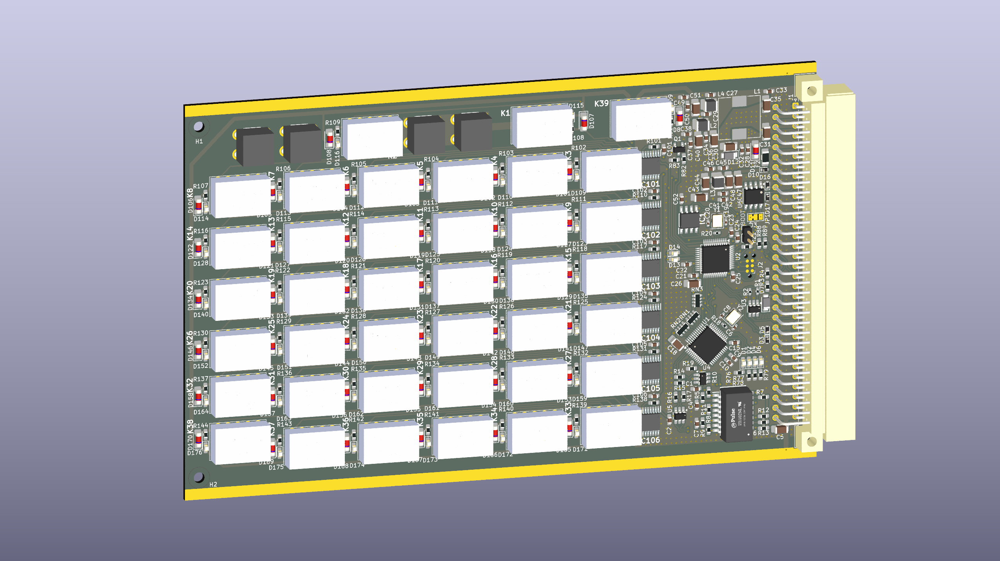

# RDE (Resistance DEcade)
Resistance DEcade with SCPI, UART, USB, RS485 and ETHERNET in 3U eurocard format

---
## Status : WIP

- First revision of schematic and PCB is done. 
- Creating a complementary board with a DIN 41612 connector and other interface connectors to order a complete assembly and begin work on software and interface testing.

---
## Features:
- 2 layer board
- ARM Cortex-M33 Processor in LQFP48 (STM32G431CBT6) 
- 0 - 999k&#8486; ressistor-relay matrix driven by 6x STPIC6C595
- USB 2.0
- 10/100 Ethernet (based on WIZnet W5500)
- UART
- Half-duplex RS485 
- 3U eurocard IEEE 1101.1-1998 format (160x100 mm)
----

## License and Contribution

[MIT License](/LICENSE)

Open to contributions in both software and hardware!
