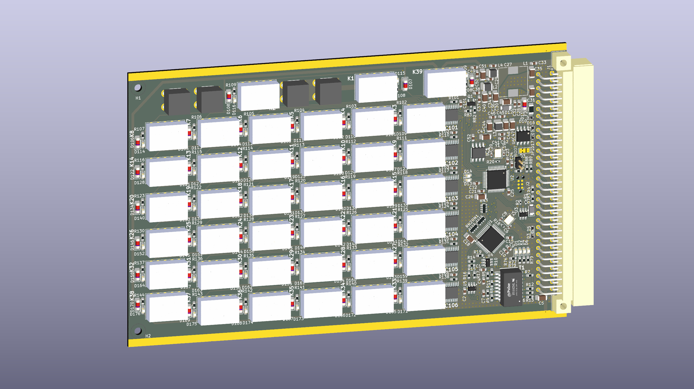

# RDE – Programowalny Dekadnik Rezystancyjny

**RDE** (Resistance DEcade) to precyzyjny, programowalny dekadnik rezystancyjny w formacie **3U Eurocard** sterowany przez SCPI. Zastępuje ręczną skrzynkę oporową w stanowiskach automatycznego testowania.



---

## Schemat systemu

```
         ┌─────────────────────────────────────────┐
         │           STM32G431CBT6 @ 170 MHz        │
         │                                         │
USB ─────│─ USB-TMC (TinyUSB)   SPI1 ─ STPIC×6 ────── 48 przekaźników
         │                              REL_EN     │   (6 dekad + Q6/Q7)
RJ-45 ───│─ W5500 (SPI2)        SPI2 ─ W5500      │
  DHCP   │   └─ VXI-11 :703             I2C1 ─ FM24C64B
  mDNS   │   └─ Portmapper :111         UART1 ─ Debug
         │   └─ mDNS :5353              UART2 ─ RS485
         └─────────────────────────────────────────┘
```

---

## Specyfikacja

| Parametr | Wartość |
|---------|---------|
| Zakres rezystancji | 0 – 999 999 Ω (krok 1 Ω) |
| Dekady | 6 (1 Ω / 10 Ω / 100 Ω / 1 kΩ / 10 kΩ / 100 kΩ) |
| Interfejsy | USB-TMC, VXI-11/Ethernet, UART, RS485 |
| Procesor | ARM Cortex-M33 @ 170 MHz (STM32G431CBT6) |
| Ethernet | WIZnet W5500, 10 Mbps (v0.3), DHCP + mDNS |
| Sterowniki przekaźników | 6× STPIC6C595 (shift-register, SPI) |
| Pamięć nieulotna | FM24C64B FRAM 8 KB + flash STM32G4 (zapas) |
| Kalibracja | 60 punktów (6 dekad × 10 cyfr), CRC32, zapis w FRAM |
| Protokół | SCPI-1999 / IEEE 488.2 |
| Format płyty | 3U Eurocard 160 × 100 mm (IEEE 1101.1-1998) |
| USB VID/PID | `0xCAFE` / `0x4000` |

---

## Szybki start

=== "USB-TMC"

    ```python
    import pyvisa

    rm = pyvisa.ResourceManager('@py')
    inst = rm.open_resource('USB0::0xCAFE::0x4000::A3F7B201::0::INSTR')
    inst.timeout = 3000
    print(inst.query('*IDN?'))
    # bartkepl,RDE,1.0,A3F7B201

    inst.write('RESistance:VALue 4700')
    inst.write('OUTPut:STATe ON')
    ```

=== "VXI-11 / Ethernet"

    ```python
    import pyvisa

    rm = pyvisa.ResourceManager('@py')
    inst = rm.open_resource('TCPIP::192.168.1.6::INSTR')
    inst.timeout = 5000
    print(inst.query('*IDN?'))
    # bartkepl,RDE,1.0,A3F7B201

    inst.write('RESistance:VALue 4700')
    inst.write('OUTPut:STATe ON')
    ```

=== "mDNS (bez znajomości IP)"

    ```python
    import pyvisa

    rm = pyvisa.ResourceManager('@py')
    inst = rm.open_resource('TCPIP::RDE-A3F7B201.local::INSTR')
    print(inst.query('*IDN?'))
    ```

---

## Grupy komend SCPI

| Prefix | Opis | Strona |
|--------|------|--------|
| `*` | Komendy IEEE 488.2 (IDN, RST, CLS, TST…) | [IEEE 488.2](scpi/ieee488.md) |
| `RESistance`, `OUTPut` | Ustawianie rezystancji, sterowanie wyjściem | [RESistance & OUTPut](scpi/resistance.md) |
| `RELay` | Surowy dostęp do bitów shift-registrów (serwis) | [RELay](scpi/relay.md) |
| `CALibration` | Kalibracja 60-punktowa | [CALibration](scpi/calibration.md) |
| `NET` | Konfiguracja sieci Ethernet | [NET](scpi/network.md) |
| `SYSTem` | Błędy, numer seryjny, bootloader, reset | [SYSTem](scpi/system.md) |

---

## Struktura dokumentacji

| Sekcja | Zawartość |
|--------|-----------|
| **[Pierwsze kroki](getting-started.md)** | Instalacja sterowników, połączenie, pierwsze komendy |
| **[Sprzęt](hardware/index.md)** | MCU, macierz przekaźników, Ethernet, pamięć FRAM |
| **[Firmware](firmware/index.md)** | Architektura kodu, inicjalizacja, API |
| **[Komendy SCPI](scpi/index.md)** | Pełna dokumentacja wszystkich komend |
| **[Procedura kalibracji](calibration.md)** | Krok po kroku: ręczna i automatyczna |
| **[Aplikacja rde_control.py](rde_control.md)** | Opis GUI Python, multimetry, raport PDF |
| **[Status & TODO](todo.md)** | Co zrealizowano, co pozostało, znane błędy |

---

## Licencja

Projekt na licencji **MIT** – zapraszamy do współpracy przy kodzie i elektronice.
